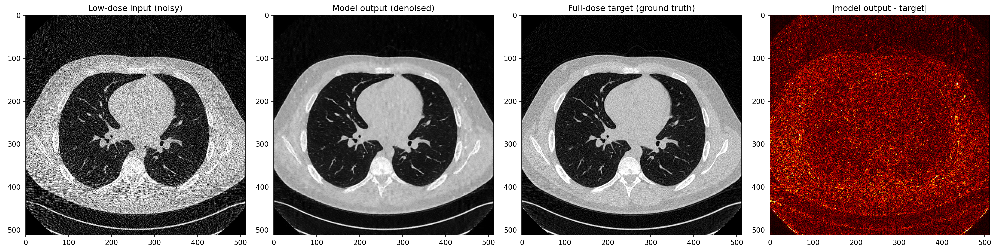
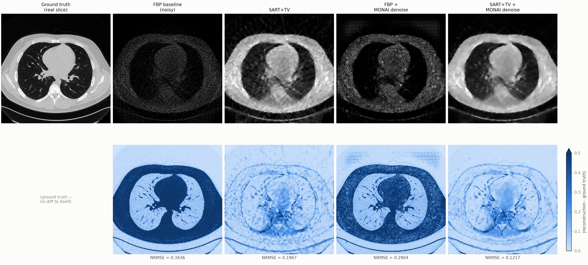
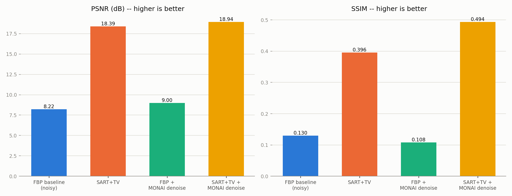

# CT Low-Dose Denoising with MONAI

A learned, FBPConvNet-style CNN denoiser for low-dose CT, trained with
[MONAI](https://monai.io/) on real clinical data from the AAPM/Mayo Clinic
Low-Dose CT Grand Challenge, benchmarked against classical FBP and against an
iterative SART+TV reconstruction from a companion C++ project.

Part of a five-project CT reconstruction series (from-scratch FBP → iterative
SART+TV → fan/cone-beam FDK → CUDA-accelerated back-projection → this). Unlike
the earlier C++/CUDA projects, this one stays entirely in Python, since deep
learning experimentation is Python-first industry-wide.

## Highlights

- **+9.10 dB PSNR / +0.271 SSIM** improvement over noisy low-dose input on
  real held-out clinical test patients (17.74 dB → 26.84 dB; 0.306 → 0.577 SSIM).
- Trained on 10 real patients (~2,000 axial CT slices) from the public
  TCIA `LDCT-and-Projection-data` collection — genuine clinical low-dose noise,
  not synthetic.
- **A CNN trained on real clinical noise catastrophically fails on
  differently-generated synthetic noise** (checkerboard artifacts, near-zero
  improvement) — a concrete, visually confirmed demonstration of the
  generalization gap between learned and physics-based reconstruction methods.
- Cascading a classical iterative method (SART+TV) into the learned denoiser
  recovers the win: **best result of all four methods tested**
  (18.94 dB / 0.494 SSIM / 0.122 NRMSE), because SART+TV's output looks
  enough like the CNN's training distribution for it to help instead of hurt.
- Packaged as a Linux Docker container structured to match Siemens
  Healthineers' publicly documented Frontier Developer Portal onboarding
  conventions, built and verified end-to-end locally (real `docker run`
  against real DICOM data) — **not** deployed to the live platform, which
  requires institutional access not available here. Details
  [below](#packaging-as-a-frontier-developer-portal-processing-unit-local-proof-of-concept).

## Results

### Main result: denoising real clinical low-dose CT

Trained 100 epochs on 6 patients (1,987 slices), validated on 2, tested on 2
held-out patients never seen during training or validation.

| | baseline (noisy low-dose) | model output |
|---|---|---|
| PSNR | 17.74 dB (std 1.51) | **26.84 dB** (std 1.48) |
| SSIM | 0.306 (std 0.052) | **0.577** (std 0.066) |



The model recovers clean vessel branching and smooth lung fields, essentially
removing the streak/speckle noise pattern visible in the input. The residual
diff map shows the model's main remaining weakness: slight edge softening
along vessel boundaries, the classic signature of an MSE-trained denoiser
regressing toward the mean at high-frequency structure. A perceptual or SSIM
loss term would be the natural next step to address this.

### Cross-project comparison: learned vs. classical reconstruction

To benchmark against [Project 2](../Project_2)'s SART+TV iterative
reconstruction (which uses parallel-beam geometry and simulated Poisson
noise, not real scanner physics), one real CT slice was forward-projected
through Project 2's operator, given simulated low-dose noise, and
reconstructed four ways.

| method | PSNR (dB) | SSIM | NRMSE |
|---|---|---|---|
| FBP baseline (noisy) | 8.22 | 0.130 | 0.344 |
| SART+TV | 18.39 | 0.396 | 0.197 |
| FBP + MONAI denoise | 9.00 | 0.108 | 0.290 |
| **SART+TV + MONAI denoise** | **18.94** | **0.494** | **0.122** |





**The interesting result here isn't the numbers — it's why "FBP + MONAI
denoise" barely helps at all.** The MONAI model was trained exclusively on
real clinical low-dose noise (real scanner fan-beam geometry, ~quarter-dose
photon statistics). This comparison's noisy input comes from a completely
different pipeline: parallel-beam geometry, only 180 projection angles, and a
Poisson noise model tuned for a synthetic phantom. Fed that out-of-distribution
input, the CNN doesn't fail gracefully — it produces a visible checkerboard
artifact pattern, a recognized signature of a network operating far outside
its training domain. SART+TV has no such dependence: it re-derives the
reconstruction from the same physical forward/back-projection operators every
time, so it degrades gracefully regardless of the input's noise
characteristics.

Feeding SART+TV's (much cleaner, more realistic-looking) output through the
same MONAI model instead of raw FBP recovers a genuine improvement — because
that input is close enough to the CNN's training distribution for it to
contribute a legitimate correction rather than hallucinate noise. This is the
practical, concrete version of the generalization-gap discussion below.

## Known operator learning

A fully learned, black-box CNN is only as good as its training distribution
and can fail unpredictably outside it (as demonstrated above). **Known
operator learning** (Maier et al., FAU Erlangen-Nürnberg Pattern Recognition
Lab) proposes building a network's known-correct components — the Radon
transform, back-projection, the ramp filter — as fixed or partially-trainable
layers, and only learning the parts with no exact physical model (scatter,
beam hardening, detector non-linearity). Benefits: far fewer parameters to
learn, better generalization (the physics doesn't need training data to be
exactly right), and a much easier regulatory story for medical-device AI —
you can point to most of the network and say "this is exactly the Radon
transform, mathematically provable," and only need to validate the small
learned residual.

This project's `ResidualDenoiser` (`output = input + UNet(input)`) is a mild
version of the same idea — injecting the prior "output should be close to
input" directly into the architecture rather than making the network learn
it from scratch. A full known-operator implementation would go further:
build differentiable forward/back-projection layers (reusing the exact math
from Projects 1–4) directly into the network, with only a small learned
correction between them. Out of scope here — it needs a differentiable
projector (e.g. TorchRadon, ODL, or a custom autograd wrapper around ASTRA),
which is a natural follow-on project in its own right.

## Packaging as a Frontier Developer Portal processing unit (local proof of concept)

> **Scope, stated plainly:** this packages the trained model above as a Linux
> Docker container structured to match Siemens Healthineers' publicly
> documented Frontier Developer Portal onboarding conventions
> ([docs.frontier.api.teamplay.siemens-healthineers.com](https://docs.frontier.api.teamplay.siemens-healthineers.com)).
> Everything below was built, run, and verified **entirely locally** —
> real `docker build` / `docker run`, real DICOM data, real output files
> checked byte-for-byte. It has **not** been deployed to, registered on, or
> executed on the live Frontier platform, which requires institutional
> (teamplay) access that isn't available here. Every claim below is scoped
> to "matches the documented conventions" and "verified locally," never
> "deployed" or "live."

The real docs (pulled directly, not assumed) specify a fixed contract
between the platform and a processing unit: mount four host directories at
fixed paths (`/mnt/input`, `/mnt/output`, `/mnt/config`, `/mnt/log`), run
the container to completion, collect whatever's in the output directory.
That contract is exactly what [`frontier-app/`](frontier-app/) implements
around the already-trained model, reusing the existing inference code
rather than duplicating it:

- **`entrypoint.py`** — reads the fixed mount paths, loads config (with
  sensible defaults if none is present), runs the full DICOM-load →
  preprocess → inference → DICOM-write pipeline (reusing `src/model.py`
  and a new `src/inference.py`, not duplicating the model or training
  code), logs to both a file and stdout, and exits non-zero on failure so
  a container crash is signaled correctly, not silently swallowed.
- **`data_selection_rules.json`** — Frontier's real DICOM-tag rule grammar
  (not a flat SOP Class UID list): `Modality=CT` via `(0008,0060) EQUALS
  "CT"`, a series-description filter, and a minimum-slice-count floor to
  reject a stray localizer/scout frame.
- **`config_schema.json`** — a standard JSON Schema (the general web
  standard, not Frontier-specific) exposing the two parameters the
  container actually reads: which trained checkpoint to use (a dropdown of
  the two real checkpoints, not free text) and inference batch size.
- **`Dockerfile`** — `python:3.11-slim`, CPU-only PyTorch (explicitly, via
  PyTorch's CPU wheel index — plain `pip install torch` defaults to the
  CUDA build even on a CPU-only base image), and a lean image containing
  only the four files and two checkpoints actually needed at inference
  time, not the whole repo. Final image: **460MB content size**.

**Verified end-to-end against real data**, not just "it builds": ran the
actual container via `docker run` with all four `-v` mounts against C052's
real low-dose series (the same held-out test patient used throughout this
project) — 342 slices in, 342 valid denoised DICOM files out, confirmed via
round-tripping pixel data back to HU (`[-1000.0, 400.0]`, self-consistent),
correct `SeriesDescription`, and correct UID semantics: exactly one shared
`SeriesInstanceUID` across the output series and 342 unique
`SOPInstanceUID`s (one per slice) — not overwriting the identity of the
original input series.

**Honest limitations, stated rather than glossed over:**
- The HU windowing clip (`[-1000, 400]`) used for training is irreversible
  — the denoised output can only ever represent that range; anything denser
  (bone, contrast, metal) gets flattened, not recovered.
- The publicly available docs don't specify `SeriesDescription` match
  semantics (exact vs. substring, case sensitivity) — the rule is written
  defensively but that ambiguity is real, not resolved.
- A correct Modality+anatomy filter doesn't guarantee acquisition
  *protocol* match (reconstruction kernel, slice thickness) to training
  data — the same distribution-sensitivity finding as the SART+TV/MONAI
  generalization gap earlier in this README.
- No GPU test environment was available, so only the CPU path is built and
  verified; a GPU-enabled variant is a base-image swap, not implemented or
  tested here.

**Bugs found while building this:**
- **A recurring class of bug across three separate stages**: confusing a
  local dev-machine path with a container-internal path. First in the UI
  Configuration schema (checkpoint `enum`/`default` pointed at
  `/Users/.../checkpoints/...`, which doesn't exist inside the container,
  before being corrected to `/app/checkpoints/...`), then again at actual
  `docker run` time (mounted the wrong local test-config directory,
  which itself still had the local-path config from the pre-Docker test
  harness). Same underlying mistake, caught each time by actually running
  the thing rather than assuming a path was portable.
- **A silent, non-crashing bug in the DICOM-writing step** — the dangerous
  kind. Omitting a numpy `.astype()` cast still "succeeded" with no
  exception: 342 files got written, but `PixelData` was `float64` (8
  bytes/pixel) inside a header declaring `BitsAllocated=16` (2
  bytes/pixel) — exactly 4x the correct size. Only caught by reading a
  written file back and checking its actual byte length and
  `pixel_array` shape, not by trusting "no error was raised."
- **A pre-existing bug in the original training code, found by this new
  work**: `dicom_loader.py`'s HU conversion silently produced `float64`
  instead of the `float32` its docstring promised, since pydicom's
  `RescaleSlope`/`RescaleIntercept` (a `float` subclass) triggers numpy's
  type-promotion rules on multiply. Numerically harmless (confirmed
  bit-identical values before/after the fix), but fixed properly in both
  the original file and the new inference code.
- **A Dockerfile conceptual bug, persisting across two fix attempts**:
  first using `RUN python entrypoint.py` (executes at *build* time, when
  no real input is mounted — the wrong lifecycle stage entirely), then
  `RUN ENTRYPOINT [...]` (tried nesting one Dockerfile instruction inside
  another, which isn't valid syntax). The fix is a standalone
  `ENTRYPOINT ["python", "entrypoint.py"]`, with `RUN` dropped completely.
- **A dependency-bloat issue caught only by running the real build, not by
  reading the Dockerfile**: `monai[all]` pulled in `mlflow`, `torchio`, and
  more that the inference code never touches, and plain `pip install
  torch` was about to silently pull the CUDA-enabled build (400MB+ of
  bundled NVIDIA libraries) on a CPU-only base image. Both fixed —
  `monai[all]` → plain `monai`, `torch` installed explicitly from
  PyTorch's CPU wheel index — after stopping an in-progress build rather
  than waiting for it to finish downloading files that were about to be
  removed anyway.

## Real bugs found and fixed along the way (core denoising project)

- **`nbia.downloadSeries` nests output one level deeper than expected**
  (`<path>/<SeriesInstanceUID>/*.dcm` + a JSON sidecar, not flat in
  `<path>/`), silently breaking a naive file-count check. Fixed by
  flattening post-download; caught by diagnosing *why* the check reported
  0 files instead of assuming the download had failed.
- **Colab's `scikit-image`/`numpy` version drift** broke
  `from skimage.metrics import ...` mid-session
  (`ImportError: cannot import name '_center'`). A forced
  `pip install --upgrade --force-reinstall` made it worse (upgraded numpy to
  a version incompatible with `numba`). Fixed by fully resetting the Colab
  runtime and switching to `monai.metrics.PSNRMetric`/`SSIMMetric`
  (torch-native, no numpy-version dependency) instead of chasing the
  dependency conflict. The same class of conflict hit `scipy.ndimage.zoom`
  later; sidestepped with `torch.nn.functional.interpolate` instead.
- **Silent undertraining, not a bug — but easy to mistake for one.** A first
  20-epoch run produced a barely-denoised, visually-unconvincing output
  (+1.3 dB PSNR). Before concluding the architecture or data pipeline was
  broken, checked whether validation loss had actually plateaued — it
  hadn't. Retraining to 100 epochs produced the real result (+9.1 dB). A
  reminder that "the output looks wrong" and "the code is wrong" are not the
  same diagnosis.
- **Suspiciously low baseline PSNR/SSIM** (17.7 dB / 0.31) on the real test
  set, lower than typical published Mayo/AAPM benchmark numbers. Before
  trusting the number, visually compared a full-dose/low-dose slice pair and
  their difference map to rule out a slice-pairing/registration bug.
  Confirmed correct registration (identical anatomy) and a noise pattern
  consistent with real photon-starvation statistics — this TCIA "Chest"
  collection's simulated low-dose noise is genuinely harsher than the
  classic abdominal subset most published numbers use, not a bug.
- **Duplicate variable declarations** in a self-written C++ scaffold
  (`main_ct_compare.cpp`): filling in a TODO left the original empty
  placeholder declaration in place alongside the new one
  (`std::vector<double> phantom;` followed by
  `std::vector<double> phantom = load_binary(...);`), a compile-time
  redefinition error. Fixed by removing the placeholder lines.
- **`validate_one_epoch` called the wrong variable as a function**
  (`running_loss(output, full)` instead of `loss_fn(output, full)` — a
  same-session naming mixup with the similarly-named accumulator variable a
  few lines below), which would have crashed with `TypeError: 'float' object
  is not callable` on the first validation batch.

## Repository layout

```
src/                  Python training + inference pipeline
  dicom_loader.py      DICOM series -> HU-corrected numpy volumes (training)
  dataset.py           patient-level train/val/test split, MONAI Dataset + transforms
  model.py             ResidualDenoiser (MONAI UNet + residual connection)
  train.py             training loop (MSE loss, Adam, checkpointing) -- run on Colab (GPU)
  evaluate.py          PSNR/SSIM evaluation on held-out test patients
  inference.py         single-series DICOM load/preprocess/inference/write,
                       used by frontier-app/ (below), runs CPU or GPU

comparison/            SART+TV benchmark (self-contained copy of Project 2's
                       C++ reconstruction pipeline + a Python comparison script)
  cpp/                 forward/back-projection, FBP, SART+TV, load/save_binary
    src/main_ct_compare.cpp   drives the real-CT-slice comparison
  scripts/compare_methods.py  4-way PSNR/SSIM/NRMSE comparison + figures

manifests/             TCIA download manifest (reproducible dataset selection)
checkpoints/           trained model weights (both training runs)
outputs/               final PNGs and training log

frontier-app/          Frontier Developer Portal processing unit (local
                       proof of concept -- see the section above)
  entrypoint.py         reads /mnt/{input,output,config,log}, runs inference
  data_selection_rules.json   Frontier's DICOM-tag rule grammar
  config_schema.json    JSON Schema for the UI Configuration step
  Dockerfile             CPU-only, python:3.11-slim, lean image
  requirements.txt       deployment-only deps (no matplotlib, no monai[all])
  test/                  local test fixtures + a pre-Docker Python harness
                         (test data itself is gitignored, not committed)
```

Study notes with the full session-by-session build log live outside this
repository (not pushed to GitHub).

## Setup

Data lives on Google Drive (mounted in Colab), not in this repo — the
`data/raw/<patient_id>/<full|low>/*.dcm` layout is produced by downloading
the manifest in `manifests/` via `tcia_utils.nbia.downloadSeries`.

**Python pipeline** (`src/`) — install dependencies and run on a GPU runtime (Colab):

```bash
pip install -r requirements.txt
python src/train.py
python src/evaluate.py
```

**SART+TV comparison** (`comparison/cpp/`) — builds locally, CPU-only:

```bash
cd comparison/cpp
make all              # original Shepp-Logan phantom pipeline
make build/ct_compare  # real-CT-slice comparison driver
cd build && ./ct_compare
cd ../../scripts && python3 compare_methods.py
```

**Frontier processing unit** (`frontier-app/`) — build and run locally
(build context must be the repo root, not `frontier-app/`, since the
Dockerfile copies files from `src/` and `checkpoints/` too):

```bash
docker build -f frontier-app/Dockerfile -t ct-denoiser .

docker run --rm \
  -v /path/to/input_dicom_series:/mnt/input \
  -v /path/to/output_dir:/mnt/output \
  -v /path/to/config_dir:/mnt/config \
  -v /path/to/log_dir:/mnt/log \
  ct-denoiser
```

`config_dir` should contain a `config.json` matching `config_schema.json`
(e.g. `{"checkpoint_path": "/app/checkpoints/best_model_run2_100ep.pt",
"batch_size": 8}`); omit it entirely and the container falls back to
sensible defaults.
